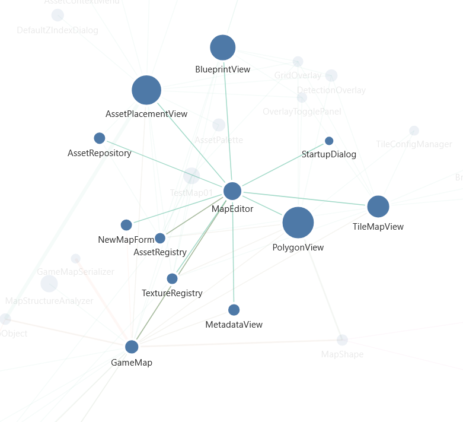
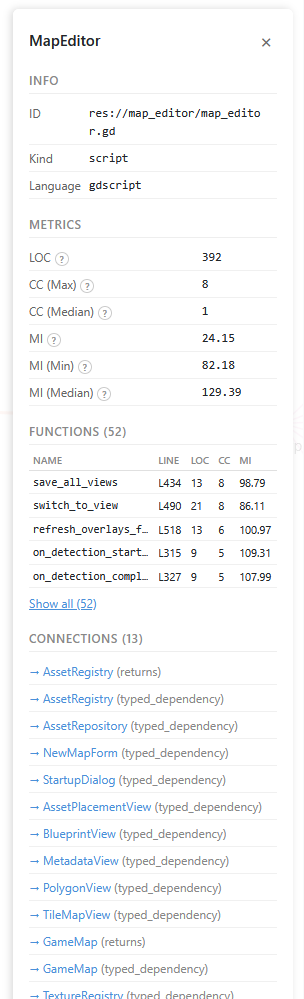

# simple-code-graph-viewer

Simple library that creates an interactive force-directed graph visualization for dependencies between classes combined with general code metrics. Embeddable in your own application. Based on D3.js. I'm using it exclusively with [gdscript-code-graph](https://github.com/MikeRoetgers/gdscript-code-graph). Should be straightforward to replicate for other languages.





## Quick Start

Install:

```bash
npm install simple-code-graph-viewer
```

Use:

```js
import { renderGraph, validateGraphData } from 'simple-code-graph-viewer';
import 'simple-code-graph-viewer/style.css';

const response = await fetch('/my-graph.json');
const json = await response.json();
const data = validateGraphData(json);

const container = document.getElementById('app');
const { destroy } = renderGraph(container, data, {
  width: window.innerWidth,
  height: window.innerHeight,
});

// Later to clean up:
destroy();
```

## Input Schema 

Detailed description can be found in [schema.md](docs/schema.md).

## API

### `renderGraph(container, data, options?)`

Renders the interactive graph into a DOM element.

```ts
function renderGraph(
  container: HTMLElement,
  data: GraphData,
  options?: RenderOptions,
): { destroy: () => void }
```

**Parameters:**

- `container` — the DOM element to render into
- `data` — validated `GraphData` object
- `options.width` — SVG width in pixels (default: 960)
- `options.height` — SVG height in pixels (default: 600)

**Returns:** an object with a `destroy()` method that stops the simulation, removes the SVG, and cleans up event listeners.

### `validateGraphData(data)`

Validates a raw JSON object against the v1.0 schema. Returns the typed `GraphData` on success, throws `SchemaValidationError` on failure.

```ts
function validateGraphData(data: unknown): GraphData
```
